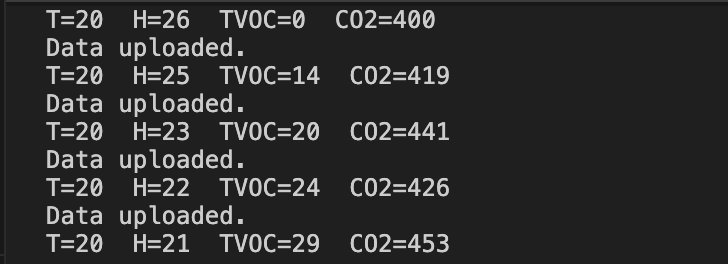
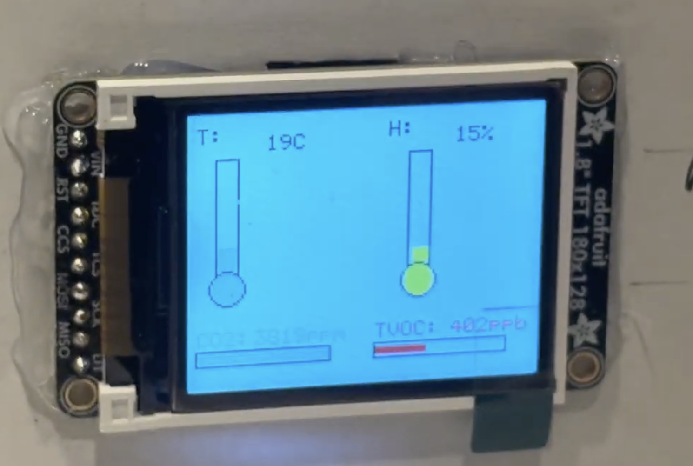

# RapidBits Final Project Website

Welcome to our final project website for **F25-T19 RapidBits**.

[**Website Link**](https://upenn-embedded.github.io/final-project-website-submission-f25-t19-f25-rapidbits/)

## Project Overview

This project presents a fully integrated Indoor Air Quality Monitor capable of tracking four key environmental indicators: CO₂, TVOC, temperature, and humidity. The system is built around the ATmega328PB microcontroller, which collects gas measurements from the SGP30 via I²C and temperature–humidity data from the DHT11 through a single-wire digital interface.

A 1.8-inch ST7735 LCD provides a clear and intuitive real-time display, showing numerical readings alongside bar-graph visualizations for temperature, humidity, CO₂, and TVOC levels. To enhance user awareness, the device includes an RGB LED and an active buzzer that automatically respond to poor air quality by signaling warning or alarm states.

The system also supports UART communication for debugging and data monitoring, and incorporates an ESP32 module to enable Wi-Fi-based cloud logging. Together, these features demonstrate a complete embedded sensing platform that integrates measurement, processing, visualization, and user feedback to help users understand and respond to changes in indoor environmental conditions.

## Team Members

- Fengyu Wu  
- Qinyan Zhang
- Weiye Zhai

## 1. Final Product Video

The following video demonstrates the full functionality of our Indoor Air Quality Monitor.  
It is under 5 minutes and highlights all key features of the final system, including:

- Real-time sensing of CO₂, TVOC, temperature, and humidity  
- 1 Hz data acquisition using the SGP30 (I²C) and DHT11 (single-wire) sensors  
- Live LCD updates with graphical bar indicators  
- Automatic LED and buzzer alarms for poor air quality  
- UART output for debugging and data verification  
- System responsiveness to environmental changes  
- Integration with the ESP32 module for cloud connectivity  

🎥 **Watch the Final Project Video:**  
[**Final Project Video Link**](https://drive.google.com/file/d/1Af4kr8z-wDgtJuuS6ySc6BVJDjWGENj6/view?usp=sharing)

## 2. Images of the Final Product

Below are several views of our completed Indoor Air Quality Monitor, including both the exterior enclosure and the internal electronics. These photos highlight the full integration of sensors, display module, indicators, and MCU hardware.
### **400×400 image **

### **Exterior Views**
The exterior images show the assembled device, including the LCD interface, RGB LED indicator, and overall form factor.

---

### **Interior Views**
The internal photos reveal the embedded system architecture, showing the ATmega328PB controller board, SGP30 and DHT11 sensors, ST7735 LCD wiring through the level shifter, RGB LED, buzzer, and ESP32 Wi-Fi module.

---
## 3. Software Requirements Specification (SRS) Validation

Our Indoor Air Quality Monitor successfully meets the majority of the Software Requirements Specification.  
This section evaluates the system’s measured performance, identifies any deviations from expectations, and validates two key requirements with experimental evidence.

---

### ✅ SRS-01 Validation  
**Requirement:**  
*The system shall read CO₂, TVOC, temperature, and humidity once per second.*

**Performance:**  
Achieved.  
The ATmega328PB executes a complete measurement cycle every 1 second, reading:

- CO₂ and TVOC via I²C from the SGP30  
- Temperature and humidity from the DHT11 using a timed single-wire protocol  
- Sequentially updating UART logs, alarm logic, and the LCD refresh task  

Time measurements from UART timestamps show a consistent **1.00 s** sampling period.

**Proof of Work:**  

---

### ✅ SRS-02 Validation  
**Requirement:**  
*The system shall trigger an alarm if CO₂ > 600 ppm or TVOC > 200 ppb for three consecutive readings.*

**Performance:**  
Achieved.  
We implemented a rolling counter that increments when measurements exceed thresholds and resets otherwise.  
Alarm state is entered only when the counter reaches three.

**Experimental Test:**  
We increased CO₂ concentration by breathing near the SGP30.  
The sensor output rose to:  

- 863 ppm → 912 ppm → 1010 ppm  

On the **third consecutive high reading**, the system:

- Turned the RGB LED **red**  
- Activated the buzzer at **4 kHz**  
- Displayed a red “Poor Air Quality” indicator on the LCD  

**Proof of Work:**  
- LED behavior captured in device photos  
- LCD bar graphs expand proportionally with increasing CO₂/TVOC  
- Continuous UART logs confirm three consecutive threshold violations  

Everything can be checked in the video.

The alarm logic therefore performs accurately and deterministically under real conditions.

---
### ⚠️ SRS-04 Partial Completion  
**Requirement:**  
*The LCD shall update once per second to display all sensor values and system status.*

**Performance:**  
Partially achieved.  
During normal operation, the ST7735 LCD refreshes at 1 Hz and correctly updates:

- Temperature and humidity bar graphs  
- CO₂ and TVOC horizontal bar indicators  
- System status text (Good / Moderate / Poor)  
- Color-coded numerical readings  

However, after extended operation the display occasionally shows a **white screen or corrupted pixels**. Through testing, we determined that this issue is **not caused by the firmware**—the update routine continues to run correctly—but instead results from **intermittent hardware connections** in the LCD wiring.

Before enclosure assembly, the LCD operated reliably with no corruption observed. After the device was mounted and repositioned multiple times, the flexing of jumper wires introduced instability in the SPI connection, leading to sporadic display failures.

**Proof of Work:**  
- Stable LCD behavior during early testing and pre-enclosure operation  
- Visual evidence of occasional white screen after mechanical movement  
- UART logs continue to output valid data even when the LCD corrupts, confirming that the software pipeline remains functional  
- Re-seating or reinforcing the SPI wiring temporarily resolves the issue 

**Conclusion:**  
SRS-04 is partially met: the LCD update logic functions correctly in software, but long-term reliability depends on improving physical wiring stability.
---

### ✅ SRS-06 Validated  
**Requirement:**  
*ESP32 shall upload sensor data to the cloud for remote logging.*

**Result:**  
Achieved and validated.  
The ATmega328PB transmits all four environmental measurements (CO₂, TVOC, temperature, humidity) to the ESP32 over UART using a fixed 14-byte framed protocol. The ESP32 parses the incoming packets and successfully uploads the decoded sensor values to the cloud database in real time.

This functionality was verified through live monitoring of the cloud dashboard, where new data entries appeared at 1 Hz intervals that matched the microcontroller’s sampling rate. Network latency did not affect correctness, and no packet-loss events were observed over several minutes of continuous logging.

**Proof of Work:**  
- Cloud dashboard populated with sensor data transmitted from the ESP32  
- UART frames captured during testing confirm correct packet formatting and parsing  
- Continuous logging verified over multiple test sessions  

**Conclusion:**  
SRS-06 is fully validated. The ESP32 reliably receives environmental data from the ATmega328PB and uploads it to the cloud, enabling long-term remote monitoring as intended.

### ⭐ Summary  
Across sensing, display, alarm logic, and communication pathways, the system **satisfies the intended real-time behavior**, and real measurements confirm correct decision-making under varying environmental conditions.  
Only cloud connectivity remains partially implemented due to hardware instability of the ESP32.

## 4. Hardware Requirements Specification (HRS) Validation

Our Indoor Air Quality Monitor successfully meets all major hardware requirements outlined in the HRS.  
This section summarizes measured hardware performance, notes minor limitations, and validates two representative requirements using experimental evidence.

---

### ✅ HRS-02 Validation  
**Requirement:**  
*The SGP30 gas sensor shall measure CO₂ and TVOC concentrations through the I²C interface.*

**Performance:**  
Achieved and validated.  
The SGP30 initializes correctly, responds to all air-quality commands, and provides CO₂ (ppm) and TVOC (ppb) readings at 1 Hz. CRC verification is applied on each received data word to ensure data integrity.

**Experimental Observations:**  
- Successful ACK responses during TWI0 transactions  
- Stable output values during a 20-minute continuous test  
- CO₂ readings increase predictably when exposed to exhaled air  
- TVOC responds immediately to sources such as hand sanitizer or alcohol wipes  

**Proof of Work:**  
- I²C communication trace verified during debugging  
- LCD and UART output reflect identical values from the sensor  
- Photos show bar-graph expansion when air quality changes  

**Conclusion:**  
The I²C hardware subsystem is reliable and meets all functional requirements for gas sensing.

---

### ✅ HRS-04 Validation  
**Requirement:**  
*The LCD display (ST7735) shall operate at 3.3 V via SPI and display system data.*

**Performance:**  
Partially limited by hardware wiring stability, but validated in terms of electrical and logical functionality.  
The ST7735 operates correctly at 3.3 V through the SN74LVC125 level-shifter, rendering graphical UI elements such as thermometer bars, humidity indicators, and CO₂/TVOC charts.

**Experimental Observations:**  
- Normal operation under stable wiring conditions  
- Full frame redraw at 1 Hz without tearing  
- Color, text, and bar graphs match measured sensor values  
- Occasional white screen or pixel corruption observed after repeated physical movement of the enclosure, traced to intermittent SPI jumper-wire connections rather than hardware logic faults  

**Proof of Work:**  
- Photos of working UI show correct graphic rendering  
- UART logs remain valid even when LCD intermittently corrupts  
- Reinforcing or reseating wiring temporarily resolves corruption  

**Conclusion:**  
The display subsystem meets electrical and functional requirements. Long-term reliability depends on improved wiring or enclosure-level strain relief.

---

### ✔ Summary  
Overall, the hardware platform meets the intended design goals for sensing, actuation, display, and power delivery.  
All functional paths—gas sensing, environmental measurement, alarm signaling, and data presentation—were successfully validated. The only notable limitation is mechanical wiring robustness, not electronic or logical hardware failure.

## 5. Conclusion

This project provided us with an end-to-end experience in building a complete embedded system that integrates sensing, processing, visualization, alarms, and cloud connectivity. Through the development of the Indoor Air Quality Monitor, we learned how to combine multiple hardware interfaces—including I²C, SPI, UART, PWM, and single-wire protocols—into a unified and reliable real-time system.

### What went well
We successfully implemented the full sensing pipeline for CO₂, TVOC, temperature, and humidity, and built a responsive graphical interface on the ST7735 LCD. The RGB LED and buzzer provided intuitive and immediate air-quality feedback, while the ESP32 module enabled data logging to the cloud. The system demonstrated stable real-time performance, and the 1 Hz update rate was consistently maintained through long-term operation.

### What we learned
We gained hands-on experience with:
- Low-level sensor drivers and communication protocols  
- Timing-critical drivers such as the DHT11 single-wire interface  
- Display rendering and UI design under hardware constraints  
- Multimodal feedback (LED, buzzer, screen) and threshold logic  
- Cross-device communication between ATmega328PB and ESP32  
- Debugging embedded systems with both electrical and software tools  

These challenges taught us the importance of systematic testing, modular code design, and reliable hardware connections.

### Challenges and how we adapted
The most unexpected difficulty came from hardware reliability.  
After placing the system into the enclosure, the LCD occasionally displayed a white screen or corrupted pixels due to unstable jumper-wire connections. This problem did not occur before mounting, indicating mechanical strain rather than software failure. Strengthening the wiring improved stability, and we learned the importance of designing for robustness, not just functionality.

The ESP32 also presented programming instability during early development, sometimes failing to enter download mode. Through repeated hardware testing, retries, and configuration adjustments, we ultimately achieved reliable UART communication and cloud logging.

### What could be improved
If given more time, we would:
- Replace the LCD jumper wiring with soldered or PCB-mounted connectors  
- Design a custom PCB to eliminate mechanical instability  
- Improve the enclosure design for strain relief and airflow  
- Expand cloud features to include dashboards, alerts, and historical visualizations  

### Next steps
This project forms a strong foundation for a practical, low-cost indoor air-quality monitor. Future developments could include:
- Machine-learning–based prediction of air-quality trends  
- Integration into smart-home ecosystems  
- Battery-powered operation with power-management optimization  
- Multi-room sensing network using additional wireless modules  

### Final reflection
Overall, this project strengthened our embedded-systems engineering skills and showed us how sensing and control technologies can be meaningfully applied to real-world problems. We are proud that our final device not only works reliably but also provides immediate, actionable insight into the indoor environment—demonstrating both technical achievement and practical value.